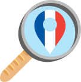
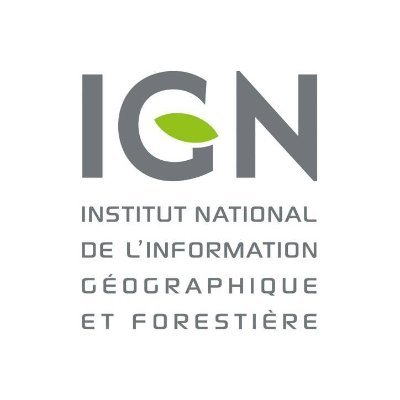
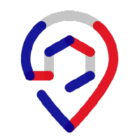

# French Locator Filter - Un plugin de géocodage pour QGIS

## Le plugin de géocodage Français officiel pour QGIS

Intégré à [la suite de plugins pour QGIS de la Géoplateforme](https://geoplateforme.github.io/plugin-qgis-geoplateforme/external_plugins/integration.html), soutenu notamment par l'IGN et recommandé par [adresse.data.gouv.fr](https://adresse.data.gouv.fr/outils#communaut%C3%A9), il est le client officiel du service de géocodage de la [Base Adresse Nationale (BAN)](https://adresse.data.gouv.fr/decouvrir-la-BAN) pour les utilisateurs de QGIS.

<!-- markdownlint-disable MD033 -->
  
<!-- markdownlint-enable MD033 -->

## Fonctionnalités

Le plugin ajoute un filtre dans la barre de recherche universelle (Localisateur) de QGIS, un outil de géocodage inversé, et des traitements Processing en lot, pour quatre sources de géocodage :

| Source                              | Préfixe locator | Géocodage direct | Géocodage inversé | Particularité |
|--------------------------------------|:---:|:---:|:---:|---|
| Adresse — Base Adresse Nationale (BAN) | `fra` | ✅ | ✅ | Client officiel de la BAN |
| Photon (OpenStreetMap)                | `pho` | ✅ | ✅ | Source alternative, hors Géoplateforme |
| Parcelle cadastrale (Géoplateforme, index `parcel`) | `par` | ✅ | ✅ | Widget de recherche structurée (département → commune → section → numéro) |
| Bâtiment — Référentiel National du Bâti (RNB) | `rnb` | ✅ | ✅ | Le résultat inversé est enrichi avec l'adresse du bâtiment ; couche de tuiles vectorielles RNB ajoutable en un clic pour vérifier visuellement le résultat |

Pour chaque source : recherche via la barre de recherche universelle, dockwidget de géocodage inversé (sélection d'un point sur la carte), et traitements Processing en lot (couche entière, direct ou inversé).

## Documentation

[🇫🇷 Consulter la documentation](https://oslandia.gitlab.io/qgis/french_locator_filter/)

## Others languages

This plugin being mainly for French users, the README is only available in French. But the documentation is mostly translated:

[🇬🇧 Check-out the documentation](https://oslandia.gitlab.io/qgis/french_locator_filter/)
