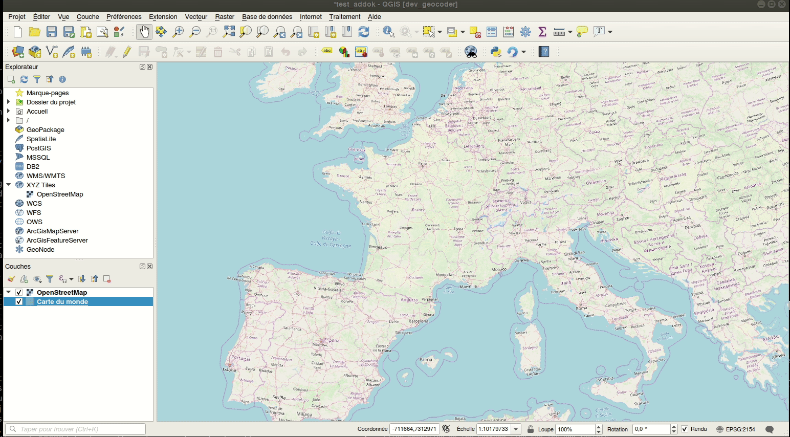

# French Locator Plugin - QGIS Plugin

[:gb: Check-out the documentation - :fr: Consulter la documentation](https://oslandia.gitlab.io/qgis/french_locator_filter/)

## TOC

- [En français](#francais)
- [In English](#english)

## Français

Extension de recherche de lieux (géocodage) utilisant l'API de la Base Adresse Nationale de la France <https://geo.api.gouv.fr/adresse>.

Cette extension permet d'activer la recherche de lieu par adresse dans [la barre de recherche universelle de QGIS (Localisateur)](https://docs.qgis.org/3.16/fr/docs/user_manual/introduction/qgis_configuration.html#locator-settings).

Ce plugin est basé sur le code de l'extension [Nominatim Locator Filter](https://plugins.qgis.org/plugins/nominatim_locator_filter/). Pour en savoir plus, consulter le billet de blog de Richard Duivenvoorde (Zuidt) (English) : <https://qgis.nl/2018/05/16/english-coding-a-qgslocator-plugin/?lang=en>.

### Utilisation

- taper librement une recherche d'adresse dans la barre de recherche (en bas à gauche de la fenêtre QGIS)
- Sélectionner un résultat. Double clic ou entrée déplace la carte sur l'adresse retenue
- taper le préfix `fr` permet de ne rechercher que des adresses fournies par ce service (et évite de rechercher les autres objets indexés par la barre Localisateur)

### Notes

L'API ne renvoie pas d'emprise permettant de zoomer exactement. Les zooms prédéfinis sont pré-définis en fonction du type de résultat :

- 1/25 000 (ville)
- 1/5000 (rue)
- 1/2000 (adresse précise)

----

## English

This is a so called QgsLocator filter for the French Adress API search service, implemented as a QGIS plugin.

This plugin is forked from the [Nominatim Locator Filter](https://plugins.qgis.org/plugins/nominatim_locator_filter/) plugin, by Richard Duivenvoorde (Zuidt). Read more about the  it: <https://qgis.nl/2018/05/16/english-coding-a-qgslocator-plugin/?lang=en>.
